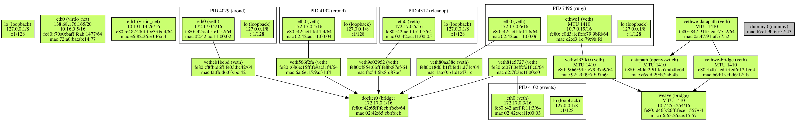
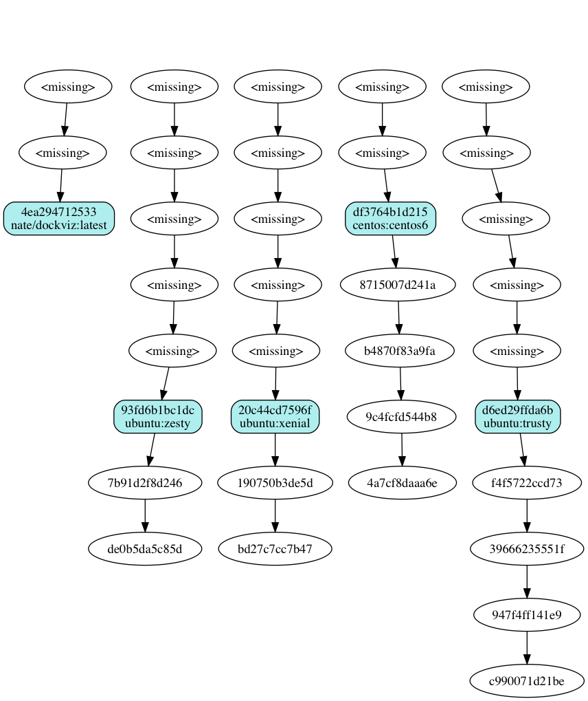

footer: © Erlang Solutions , 2018
slidenumbers: true
autoscale: true


# Welcome to the docker hackathon


---


---

# Resources

* [Learn Kubernetes in Under 3 Hours: A Detailed Guide to Orchestrating Containers](https://medium.freecodecamp.org/learn-kubernetes-in-under-3-hours-a-detailed-guide-to-orchestrating-containers-114ff420e882)

* [bryanhuntesl/k8s-mastery](https://github.com/bryanhuntesl/k8s-mastery)

* Create a [docker hub]( https://hub.docker.com/ ) account if you haven't done already.

---

# The absolute basics

```
docker run --rm --name tiny-example -ti alpine sh
```

```
/ # apk -y update && apk add vim
```
---

# Committing and pushing images

## Login

```
docker login
Authenticating with existing credentials...
Login Succeeded
```

---

# Commit and tag

```
❯ docker commit tiny-example bryanhuntesl/tiny-example
```

```
sha256:57d403f992660a6d83434f429ad42e7c80358aeae29edc9fb878493a24e4d299
```
---

# Push the example image

```
❯ docker push  bryanhuntesl/tiny-example
The push refers to repository [docker.io/bryanhuntesl/tiny-example]
52ef672c4ccd: Pushed
cd7100a72410: Mounted from bryanhuntesl/git-cache-http-server
latest: digest: sha256:8106b6df1fb7c1a93a07a06accc1ea53b8ae8d66404766eb2e6b5a54d23c6101 size: 740
```

---

# For the tutorial code - ensure  :

```
export DOCKER_USER_ID=bryanhuntesl
```

Create a docker network so the containers can talk to one another:

```
docker network create hackday
```
---

# Getting started


Again... Don't forget to..

```
export DOCKER_USER_ID=<your docker hub username>
```

---

# Don't run all the npm, python, java stuff on your host!

---

# Sample application overview (1)

*  Client communicates with the single page web application

* Application is built using NPM - runs on Nginx

---

# Sample application overview (2)

 * The user interacting with the application triggers requests to the Spring WebApp.

---

# Sample application overview (3)

* Spring WebApp forwards the requests for sentiment analysis to the Python app.

---
# Sample application overview (4)

* Python Application calculates the sentiment and returns the result as a response.

---

# Sample application overview (5)

* The Spring WebApp returns the response to the React app. (Which then represents the information to the user.)

---

# Sarcophagus

Create a container for running the sample code:

```
docker run \
  -ti \
  --rm \
  --name devtest \
  --mount type=bind,source="$(pwd)",target=/work \
  centos:7
```

---

# Installing in the CentOS container

Enter the container, update and install packages

```
yum update -y
yum -y install epel-release
yum -y install npm maven python-pip
```

---

# Backups !

It would be a shame to have to reinstall all those packages.

Lets keep a copy.

```
❯ docker commit devtest devtest2
sha256:af4ccff5543e1c1fbdf8d5c0200cef774ddb73eee85456a531586f12069d9f48

```
---

# Kill and restore

Ctrl-c to kill the container, relaunch from your new image :

```
docker run \
  -ti \
  --rm \
  --name devtest \
  --mount type=bind,source="$(pwd)",target=/work \
  devtest2
```

It's still got all your stuff!

---

# Building the applications

Lets get our hands dirty

Inside the container :

```
cd /work/sa-webapp/
mvn package
```

On the host

```
/bryanhuntesl/k8s-mastery/sa-webapp master*
❯ find . | grep jar$
./target/sentiment-analysis-web-0.0.1-SNAPSHOT.jar
```

----

# Java fan club

We've just built our first Java application.

The first of many 😂

---

# Getting esoteric

Let's move on to the really dirty stuff.. npm

```
cd /work/sa-frontend
npm install
```
---

# Getting esoteric (2)

_Check the size of the npm downloads.._

```
/bryanhuntesl/k8s-mastery master
❯ du -ms ./*
1       ./README.md
1       ./debug
1       ./resource-manifests
235     ./sa-frontend
1       ./sa-logic
21      ./sa-webapp
```

_Commit the container - I don't want to do that again.._

---

# Create an optimised npm build

```bash
[root@e9bddf049c64 sa-frontend]# npm run build

> salogic-front@0.1.0 build /work/sa-frontend
> react-scripts build

Creating an optimized production build...
Compiled successfully.

File sizes after gzip:

  73 KB  build/static/js/main.7bd4a5f6.js
  356 B  build/static/css/main.6469d74d.css

etc etc
```

---

# Shrunk!

'build' is what actually goes into our image

```
/bryanhuntesl/k8s-mastery master
❯ du -ms ./sa-frontend/* | egrep '(build|node)'
2       ./sa-frontend/build
1       ./sa-frontend/build-container
233     ./sa-frontend/node_modules
```

---

# Commit the container, again...

---

# Start the container up again, this time exposing port 3000 to the host

(lucky we keep committing)
(we need to test the network service)

```
docker run \
-ti \
--rm \
--name devtestv6 \
-p 3000:3000 \
--mount type=bind,source="$(pwd)",target=/work \
devtest4
```
---

# Running the front-end

Back we go into the container again

```
cd /work/sa-frontend/
npm start
```

Navigate to http://127.0.0.1:3000 and we see the text entry form

----

# Nginx inside a container

Install Nginx

```
yum -y install nginx
```

Commit the container

```
❯ docker commit devtest devtestv7
sha256:13505023ef540fc8e4f90e0677946231043a591f0d3047a28e434578538feb61
```

----

In the container, copy the files to the nginx hosting directory

```
cp -pr ./build/* /usr/share/nginx/html/
```

Modify the nginx listening port (you can use vim)

```
sed -i '' \
-e 's|listen       80 default_server|listen 3000 default_server|' \
/etc/nginx/nginx.conf
```

---

# Test nginx configuration

```
nginx -t -c /etc/nginx/nginx.conf
```

And launch nginx ...

```
nginx -c /etc//nginx/nginx.conf
```

---

# Lets try building frontend into an image

On the host:

```bash
❯ docker build -f Dockerfile -t $DOCKER_USER_ID/sentiment-analysis-frontend .
Sending build context to Docker daemon  193.1MB
Step 1/2 : FROM nginx
 ---> ae513a47849c
Step 2/2 : COPY build /usr/share/nginx/html
 ---> Using cache
 ---> e810733f8a94
Successfully built e810733f8a94
Successfully tagged bryanhuntesl/sentiment-analysis-frontend:latest

```

!   193.1MB

---

# Try running the frontend image

```bash
docker run \
    -p8080:80 \
    bryanhuntesl/sentiment-analysis-frontend
```

Test it in the browser.. it works

http://127.0.0.1:8080

-----

Make the build more efficient


```
cat <<END >> .dockerignore
node_modules
src
public
END
```

----

# Build and run the logic component

```
docker build -f Dockerfile -t $DOCKER_USER_ID/sentiment-analysis-logic .
```

```
❯ docker run -d -p 5050:5000 $DOCKER_USER_ID/sentiment-analysis-logic
7948b6a5f5dddf5eab0ac49b770a93281393a89ff234b46825b69ee5fea6587e

```

```
❯ docker ps  | grep 5050
7948b6a5f5dd        bryanhuntesl/sentiment-analysis-logic   .... "python sentiment_an…" .... 0.0.0.0:5050->5000/tcp   jovial_carson

❯ docker kill jovial_carson
jovial_carson
```
----

Run the container on the shared network


```
docker run \
--rm \
--network hackday \
--hostname sal \
--name sal \
--network-alias sal \
-p 5050:5000 \
$DOCKER_USER_ID/sentiment-analysis-logic
```

```
 * Running on http://0.0.0.0:5000/ (Press CTRL+C to quit)
```

---

Interact with the container using an Alpine container on the same network :

```
❯ docker run --network hackday -ti alpine sh
/ # ping sal
PING sal (172.20.0.4): 56 data bytes
64 bytes from 172.20.0.4: seq=0 ttl=64 time=0.111 ms
```


---

And we can curl it from the Alpine container, or the host ...

```
/ # apk update && apk -y add curl

/ # curl sal:5000
<!DOCTYPE HTML PUBLIC "-//W3C//DTD HTML 3.2 Final//EN">
<title>404 Not Found</title>
....
```

```
* Running on http://0.0.0.0:5000/ (Press CTRL+C to quit)
172.20.0.3 - - [23/May/2018 22:38:10] "GET / HTTP/1.1" 404 -
172.20.0.3 - - [23/May/2018 22:38:21] "GET / HTTP/1.1" 404 -
```

---

# If you are going to use Digital Ocean

Use a Centos 7.5 instance, Centos has the best docker support.

---

# Digital Ocean packages needed


```bash
yum update -y && yum -y install \
git \
jansson \
jansson-devel \
make \
gcc \
docker \
vim \
emacs \
kubernetes-master \
kubernetes-client \
kubernetes
```

---

Or provision your droplet with the following user-data:


```

#cloud-config
package_update: true

#cloud-config
package_upgrade: true

#cloud-config
packages:
  - git
  - jansson
  - jansson-devel
  - make
  - gcc
  - docker
  - vim
  - emacs
  - kubernetes-master
  - kubernetes-client
  - kubernetes
```

---

Once you log into digital ocean ..

You'll also need to start docker.

```
service docker start
```

---

Some cute tricks

---

# plotnetcfg



---

# Installing plotnetcfg

```
git clone https://github.com/bryanhuntesl/plotnetcfg.git
cd plotnetcfg/
make
./plotnetcfg
```

---

# dockviz



---

# Installing dockviz

```
docker run -it --rm -v /var/run/docker.sock:/var/run/docker.sock nate/dockviz

https://github.com/bryanhuntesl/dockviz
```
---

Questions

Breaktime

Get hacking

